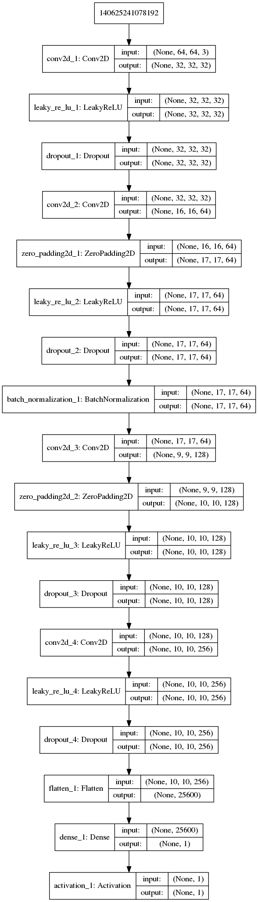
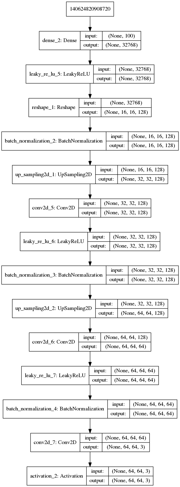

# Pix2Pix for Denoise

DCGANを用いてポケモンのドット絵を生成する

# result


# code
以下コードの説明

## dcgan.py
DCGAN学習スクリプト

```
usage: dcgan.py [-h] --datasetpath DATASETPATH [--imgsize IMGSIZE]
                [--epochs EPOCHS] [--channels CHANNELS] [--zdims ZDIMS]
                [--batchsize BATCHSIZE] [--saveinterval SAVEINTERVAL]
                [--line_token LINE_TOKEN]

Train pokemon generate model using DCGAN

optional arguments:
  -h, --help            show this help message and exit
  --datasetpath DATASETPATH, -p DATASETPATH
  --imgsize IMGSIZE, -s IMGSIZE
  --epochs EPOCHS, -e EPOCHS
  --channels CHANNELS, -c CHANNELS
  --zdims ZDIMS, -d ZDIMS
  --batchsize BATCHSIZE, -b BATCHSIZE
  --saveinterval SAVEINTERVAL, -i SAVEINTERVAL
  --line_token LINE_TOKEN, -l LINE_TOKEN
```

## img_load.py
画像を読み込むスクリプト
dcgan.pyから呼び出し

## model.py
モデルを構築するスクリプト
dcgan,pyから呼び出し

## gan.py
GANの学習スクリプト

## png2jpg.py
pngの画像をjpg形式に変換するスクリプト
```
usage: png2jpg.py [-h] [--originpath ORIGINPATH] [--convertpath CONVERTPATH]
                  [--generation GENERATION]

convert png to jpg image file

optional arguments:
  -h, --help            show this help message and exit
  --originpath ORIGINPATH, -o ORIGINPATH
  --convertpath CONVERTPATH, -t CONVERTPATH
  --generation GENERATION, -g GENERATION
```
## img_infla.py
画像の水増しを行うスクリプト

# prepare datasets
データはこちらのサイトから拝借いたしました．

http://hikochans.com/

# model
plot model architecture

### Dsicriminator


### Generator


# Requirement

- Software
    - python3.6.3
    - tensorflow==1.7.0
    - keras==2.1.5
    - numpy==1.14.0
    - matplotlib==2.2.2
    - opencv-python==3.4.1.15
    - Pillow==5.1.0
